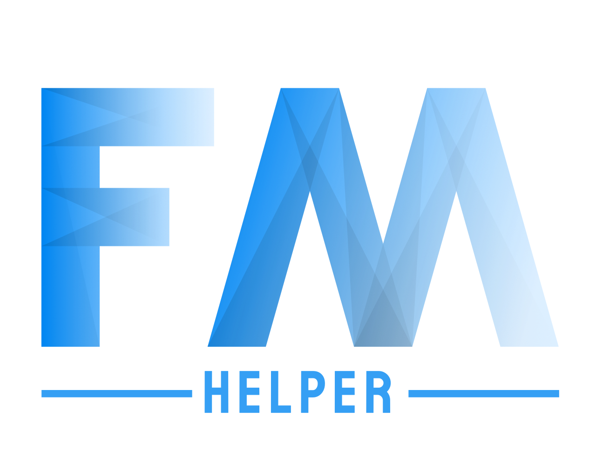
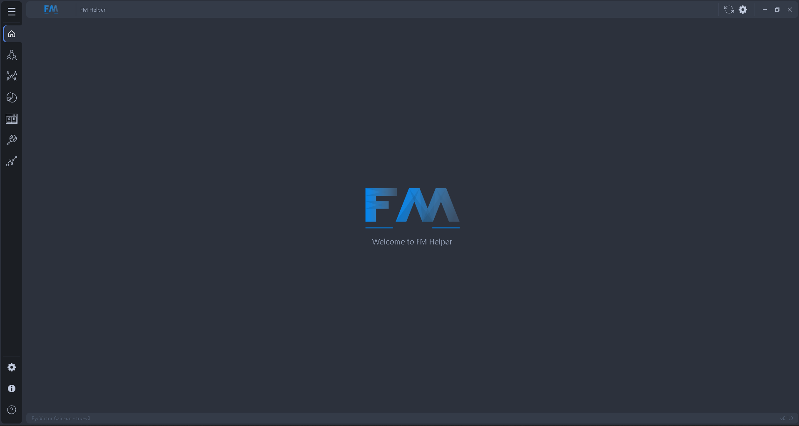
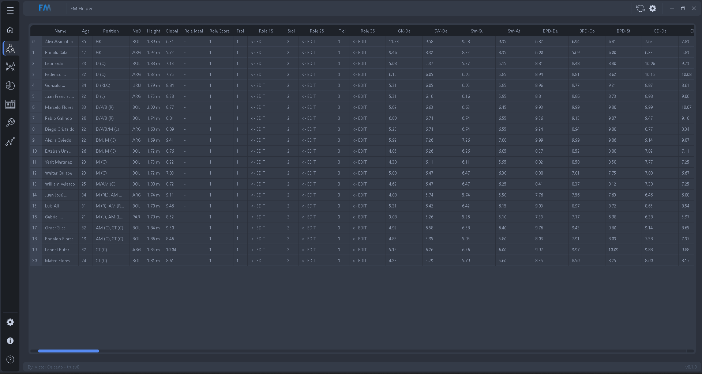
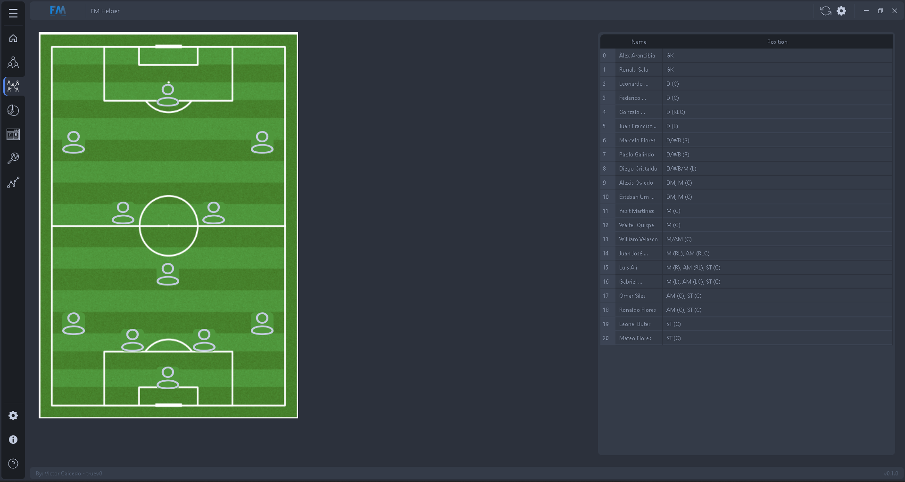
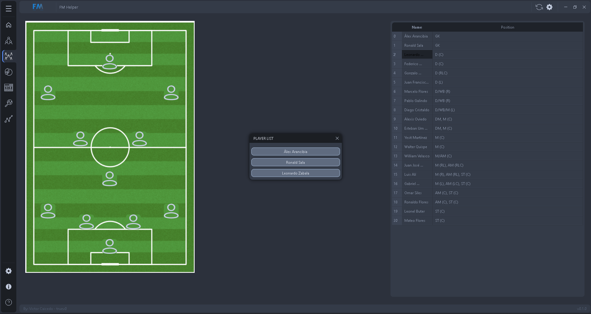
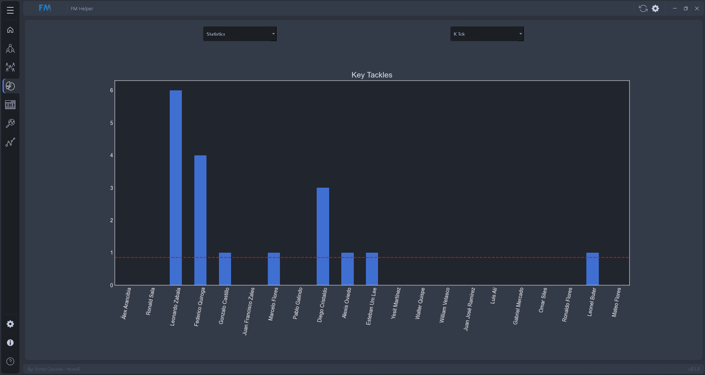
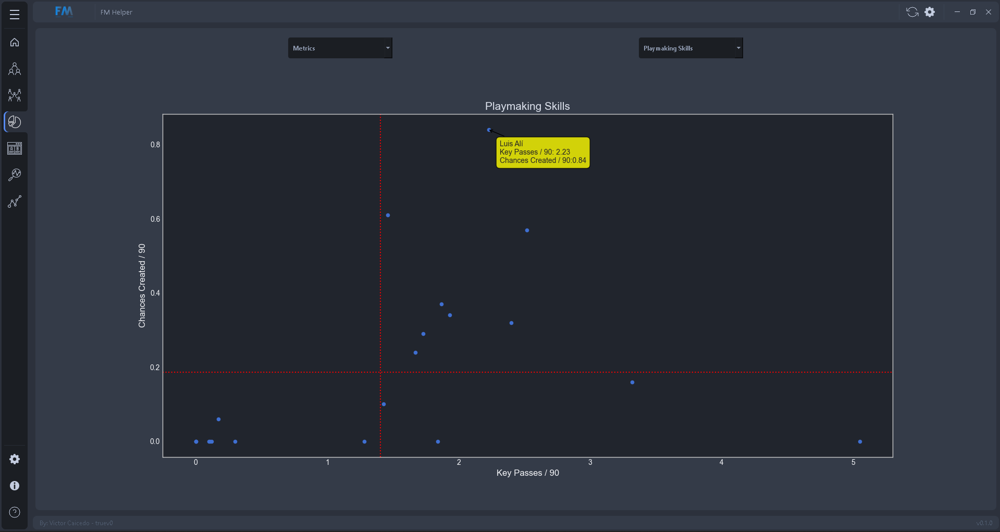
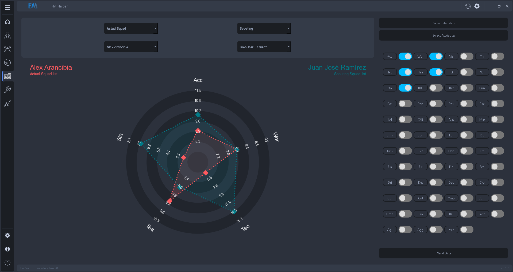
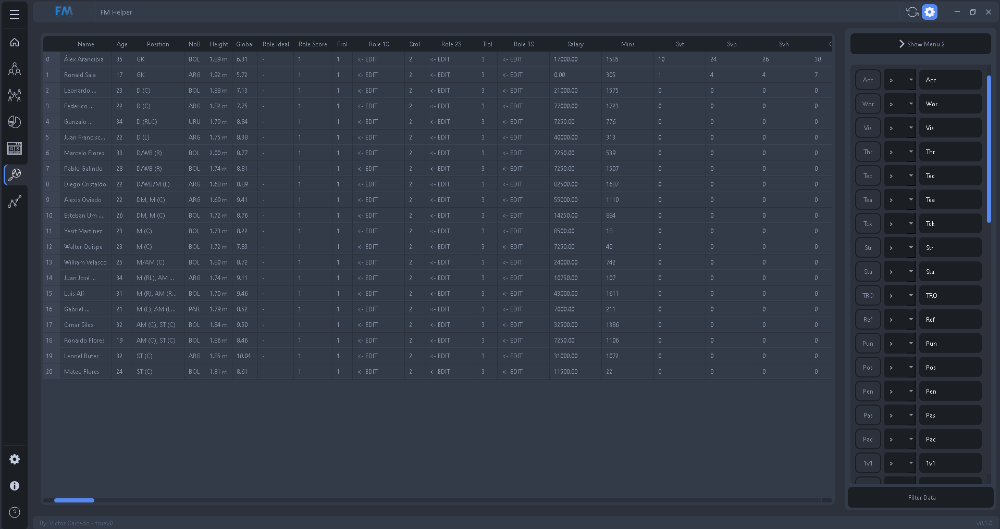
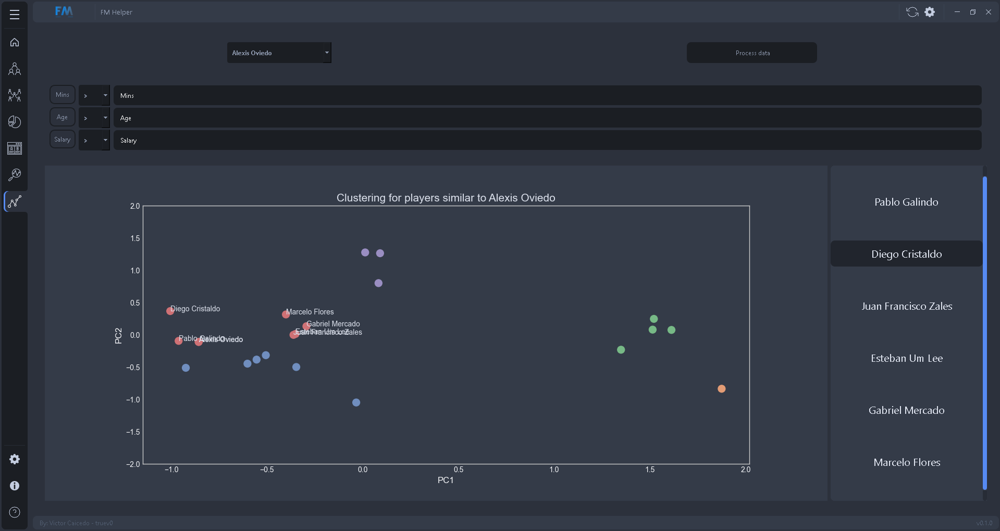

<!-- PROJECT SHIELDS -->

 

<!-- PROJECT LOGO -->
 

  

<h2 align="center">Football Manager Helper</h2>

  

    Aplicación para administrar, organizar y gestionar plantillas en el juego Football Manager. Analizando evolución de jugadores y sus datos.
     
    <a href="https://github.com/truev0/FootballManager-Helper"><strong>Explorar documentación »</strong></a>
     
     
    <a href="https://github.com/truev0/FootballManager-Helper">Ver Demo</a>
    ·
    <a href="https://github.com/truev0/FootballManager-Helper/issues">Reportar un error</a>
    ·
    <a href="https://github.com/truev0/FootballManager-Helper/issues">Solicitar funcionalidad</a>
  

<!-- TABLE OF CONTENTS -->

  
Tabla de contenidos

  <ol>
    <li>
      <a href="#sobre-el-proyecto">Sobre el proyecto</a>
      <ul>
        <li><a href="#construido-con">Contruido con</a></li>
      </ul>
    </li>
    <li>
      <a href="#empecemos">Empecemos!</a>
      <ul>
        <li><a href="#pre-requisitos">Pre-requisitos</a></li>
        <li><a href="#instalacion">Instalación</a></li>
      </ul>
    </li>
    <li><a href="#usos">Usos</a></li>
    <li><a href="#roadmap">Roadmap</a></li>
    <li><a href="#contribuir">Contribuir</a></li>
    <li><a href="#apoyos">Apoyos</a></li>
    <li><a href="#stargazers">Stargazers</a></li>
    <li><a href="#licencia">Licencia</a></li>
    <li><a href="#contacto">Contacto</a></li>
    <li><a href="#agradecimientos">Agradecimientos</a></li>
  </ol>

<!-- ABOUT THE PROJECT -->
## Sobre el proyecto

  <b>Football Manager Helper</b> es una aplicación desarrollada en <a href="https://github.com/expressjs/express">Python
  </a> inspirada en el documento de excel <a href="https://www.fmsite.net/files/file/1120-organizador-de-plantilla-y-empleados-v30-pandafm-ft-el-parce-excel-actualizado-al-12422/">
  Organizador de Plantilla y Empleados</a>, de  <b><a href="https://twitter.com/f_mpanda">PandaFM</a></b>. Diseñado para
  <b>facilitar</b> la gestion de equipo para mejorar la <b>inmersión</b> en el juego, permitiendo conocer cada detalle 
  de tu plantilla y asi tener un control <b>total</b> de la misma.

(<a href="#top">volver arriba</a>)

### Construido con

* [Python](https://www.python.org/)

<b>Paquetes usados en el proyecto</b>
* [Numpy](https://numpy.org)
* [Pandas](https://pandas.pydata.org)
* [Matplotlib](https://matplotlib.org)
* [Scikit-learn](https://scikit-learn.org/stable/)
* [mplcursors](https://mplcursors.readthedocs.io/en/stable/)
* [PySide6](https://www.qt.io/qt-for-python#:~:text=Qt%20for%20Python%20is%20the,should%20consider%20Qt%20for%20Python.)

(<a href="#top">volver arriba</a>)

## 🚀 Empecemos!

Lo primero que debes tener en cuenta para empezar es que deberás descargar nuestras vistas personalizadas
para plantilla y ojeo la cual encontraras en el apartado 
<b><a href="https://github.com/truev0/FootballManager-Helper/releases">Releases</a></b> junto con el instalador de la aplicación.

Estas vistas deberás importarlas en las páginas correspondientes de Football Manager 2022, cargarlas correctamente:
* Después dependiendo de que quieras exportar, vas a `Plantilla` o `Ojeo`
* Presionar`Ctrl + A` para seleccionar todos los datos de jugadores
* Presionar `Ctrl + P` para exportar y seleccionas exportar como página web

<!-- GETTING STARTED -->
### 💻 Pre-requisitos

Antes de comenzar, verifique si cuenta con los siguientes requisitos:
* Un computador que cuente con `Windows`.
* Ganas de viciar con `Football Manager`.

### ⚙️ Instalación

Nuestro sistema es un clasico sistema de instalación, donde primeramente deberás descargar el archivo y posteriormente 
ejecutarlo.

Seleccionarás un lugar donde instalar la aplicación y después solo... SIGUIENTE - SIGUIENTE - FINALIZAR!

(<a href="#top">volver arriba</a>)

<!-- USAGE EXAMPLES -->
## 🎯 Uso

<b>[Video guia](https://www.youtube.com/)</b>

  
<b>App Screenshots</b>

  
  
  
  
  
  
  
  
  

(<a href="#top">volver arriba</a>)

<!-- ROADMAP -->
## 📝 Roadmap

- [x] Estructura del proyecto
- [x] Estructura de interfaz gráfica
- [x] Estructura de datos
- [x] Core para el tratamiento de datos
- [ ] Funcionalidades principales
    - [x] Edición de la tabla de la plantilla
    - [x] Campo de tactica y gestión por posición
    - [x] Gráficos de estadísticas y métricas
    - [x] Gráfico de comparación de jugadores
    - [x] Tabla y filtrado de scouting
    - [ ] Gestion de empleados
    - [x] Funcionalidad sorpresa
- [x] Soporte multi-lenguaje
    - [x] Español
    - [x] Inglés
- [x] Interactividad
- [X] Documentación

Ver [issues](https://github.com/truev0/FootballManager-Helper/issues) para ver un listado de caracteristicas propuestas y errores pendientes por resolver

(<a href="#top">volver arriba</a>)

<!-- CONTRIBUTING -->
## 👍 Contribuir

Si quieres decirme **GRACIAS** por el trabajo realizado y/o apoyar el constante desarrollo y mantenimiento de `Football Manager Helper`:

Las contribuciones son lo que hace que la comunidad de código abierto sea un lugar increíble para aprender, inspirar y crear. Cualquier contribución que hagas será **muy apreciada**

Si tienes alguna sugerencia para mejorar esto, por favor, haz un fork del repositorio y crea un pull request. Tambien puedes abrir un issue con la etiqueta "MEJORAS".
No olvides dar una estrella al proyecto. Gracias de nuevo.

1. Dale una [Estrella de Github](https://github.com/truev0/FootballManager-Helper/stargazers) al proyecto.
2. Tuitea sobre el proyecto [en tu Twitter](https://twitter.com/intent/tweet?text=FM+Helper+es+una+app+para+la+gesti%C3%B3n+de+tu+club+y+sus+plantillas%2C+inspirado+en+el+excel+de+%40f_mpanda+y+construido+en+%23python.+Dise%C3%B1ado+para+tener+todo+bajo+control+de+una+manera+f%C3%A1cil+y+sencilla%F0%9F%9A%80+https%3A%2F%2Fgithub.com%2Ftruev0%2FFootballManager-Helper).
3. Haz una review sobre la aplicación en [Youtube](https://youtube.com) o en tu blog personal.
4. Apoya el proyecto donando una [cerveza](https://www.buymeacoffee.com/soyelparce)

(<a href="#top">volver arriba</a>)

<!-- SUPPORTERS -->
## 🍺 Apoyos

Football Manager Helper es un proyecto de codigo abierto que funciona con donaciones para pagar las facturas como por 
ejemplo el internet, energía, etc. Si me quieres apoyar tu puedes 🍺, [**comprar una cerveza aqui**](https://www.buymeacoffee.com/soyelparce).

|                                                                                                                  | Usuario | Donación |
|:-----------------------------------------------------------------------------------------------------------------|:--------|:---------|
|  | [@JuanchoLavigne](https://twitter.com/JuanchoLavigne) | 🍺 x 3     |

## ⭐️ Stargazers

<!-- LICENSE -->
## ⚠️ Licencia

Copyright (c) 2022
`Football Manager Helper` es un software libre y de código abierto bajo la licencia MIT. El logo
oficial fue creado por [Victor Caicedo](https://github.com/truev0) y distribuido bajo la licencia [Creative Commons](https://creativecommons.org/licenses/by-sa/4.0/)
(CC BY-SA 4.0 International)

Para mas información lea el archivo `LICENSE`.

(<a href="#top">volver arriba</a>)

<!-- CONTACT -->
## 😄 Contacto

Victor Caicedo - [@soy_elparce](https://twitter.com/soy_elparce) - victorcaiicedo@gmail.com

Link del proyecto: [https://github.com/truev0/FootballManager-Helper](https://github.com/truev0/FootballManager-Helper)

(<a href="#top">volver arriba</a>)

<!-- ACKNOWLEDGMENTS -->
## 🤝 Agradecimientos

<table>
  <tr>
    <td align="center">
      <a href="https://twitter.com/f_mpanda">
         
        
          <b>PandaFM</b>
        
      </a>
    </td>
    <td align="center">
      <a href="https://twitter.com/JuanchoLavigne">
         
        
          <b>Juancho Lavigne</b>
        
      </a>
    </td>
    
  </tr>
</table>

(<a href="#top">volver arriba</a>)

